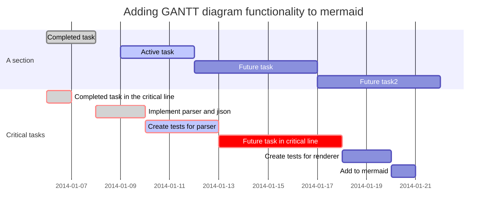
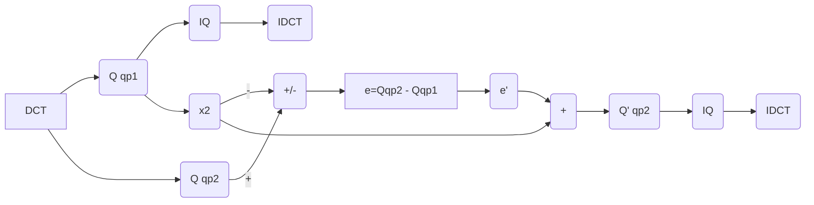

Mathematical Note
====

## $\frac{\varepsilon}{1 + \varepsilon}$을 사용한 확률 공간에서의 Convexity

Convex 조건은, Domain이 만일 Convex 일 경우 함수 $f​$가 contimuity 이면 (최소 Lipschitz Continuous 이면), Compact 조건을 만족 시킬 수 있기 떄문에 알고리즘의 수렴성 증명에 있어 매우 중요한 조건이다.

그러나 일반적인 Convex 조건에 의한 해석은 Euclidean Space $\mathbb{R}^n$ 이나, Manifold $M^n$ 에서 유효하다.
따라서 확률 변수의 경우에는 적분이 무한대 적분으로 나타내야 하는 경우가 많으므로 Convexity를 체크하기 위한 변수가 무한대에서 잡을 수 있도록 해야 한다.
따라서 이러한 경우, Convexity 변수를 $s \in \mathbb[0,1]$ 대신 $\varepsilon \in \mathbb{R}$로 놓아야 한다. 이때 Convexity Check를 위해 다음과 같이 놓아보자.
$$
\lim_{\varepsilon \rightarrow 0} \frac{\varepsilon}{1 + \varepsilon} = 0, \;\;\; \lim_{\varepsilon \rightarrow \infty} \frac{\varepsilon}{1 + \varepsilon} = 1
$$

그러므로 어떤 확률 변수 $z​$가 1과 z에서 변한다고 가정해 보자. 즉 Deterministic 한 경우에
$$
h = x + s(y - x), \;\;\; s \in \mathbb{R}[0,1]
$$

이것을 1과 z과 바꾸어 보면
$$
h = z + s(1 - z) = (1 -s)z + s = \left( 1 - \frac{\varepsilon}{1 + \varepsilon} \right) z + \frac{\varepsilon}{1 + \varepsilon} = \frac{1}{1 + \varepsilon}z + \frac{\varepsilon}{1 + \varepsilon}
$$

z와 1의 위치를 바꾸어 보면
$$
h = 1 + s(z - 1) = (1 -s) + sz = \left( 1 - \frac{\varepsilon}{1 + \varepsilon} \right) + \frac{\varepsilon}{1 + \varepsilon}z = \frac{1}{1 + \varepsilon} + \frac{\varepsilon}{1 + \varepsilon}z
$$

## Quadratic Problem
$$
\min f(x) : f(x) = \frac{1}{2} \langle x, Qx \rangle - b^T x \;\;\;\;\;\text{ minimizer } x^* = Q^{-1}b \\
\nabla f(x) = Qx -b = g(x)
$$

### Steepest Descent
$$
x_{i+1} = x_i - \alpha_i g_i \;\;\;\;\; \alpha_i = \underset{\lambda \geq 0}{\arg}  \min f(x_i - \lambda g_i)
$$

식(1)에서 최적 $\lambda$ 는 $\frac{\partial f}{\partial \lambda} = 0$을 만족한다. 즉, ($x = x_{i+1}$ 이라 생각하면, 그리고 $\alpha$ 대신 $\lambda$로 놓고 생각하면)
$$
\frac{\partial f}{\partial \lambda} = {\frac{\partial f}{\partial x}}^T \frac{\partial \lambda}{\partial x} = [Q(x_i - \lambda g_i) -b]^T(-g_i) = 0 
$$
그러므로
$$
\begin{align}
0 &= [Q(x_i - \lambda g_i) -b]^T g_i = x_i^T Q g_i - \lambda g_i^T Q g_i -b^T g_i = (Q x_i - b)^T g_i - \lambda g_i^T Q g_i \\
&\implies (Q x_i - b)^T g_i = g_i^T g_i = \lambda g_i^T Q g_i \\
&\implies \lambda = \frac{g_i^T g_i}{g_i^T Q g_i}
\end{align}
$$
따라서,
$$
x_{i+1} = x_i - \frac{g_i^T g_i}{g_i^T Q g_i} g_i
$$

### Usage 
for any $f(x)$ and given $x_i$ $\rightarrow$ Second order approximation near $x_i$
$$
f(x) \approx f(x_i) + \langle \nabla f(x_i), x- x_i \rangle + \frac{1}{2} \langle x - x_i, Q(x- x_i) \rangle
$$

이러면 문제 
$$
\left. \min f(x) \right|_{x^*}, \;\;\; f(x) = \frac{1}{2} \langle x, Qx \rangle - b^T x
$$
에 대하여  Let
$$
F(x) = \frac{1}{2} \langle x - x^*, Q(x - x^*)
$$

#### Claim  
$\min f(x)$ and $min F(x)$ construct a same $\{x_i\}$ sequence.
#### proof of claim
$$
\begin{align}
F(x) &= \frac{1}{2} \langle x, Qx \rangle - {x^*}^T Q x + \frac{1}{2} \langle x^*, Qx^* \rangle &\\
&= \frac{1}{2} \langle x, Qx \rangle - b^T x + \frac{1}{2} \langle x^*, Qx^* \rangle  &\because \nabla f(x^*) = Qx^* - b = 0 \\
&= f(x) + \frac{1}{2} \langle x^*, Qx^* \rangle
\end{align}
$$
따라서 $\frac{\partial f}{\partial x} = \frac{\partial F}{\partial x}$ 그러므로 같은 최적화 문제가 된다. 

### Lemma
$$
F(x_{i+1}) = \left[ I - \frac{(g_i^T g_i)^2}{(g_i Q g_i)(g_i Q^{-1} g_i)}  \right] F(x_i)
$$
#### proof of Lemma
$$
g_i \triangleq Qx_i -b = Qx_i - Qx^{*} = Q(x_i - x^{*}) = Qy_i
$$
따라서, $F(x_i) = \frac{1}{2}y_i^T Q y_i$. 고로
$$
F(x_i) - F(x_{i+1}) = \frac{1}{2} [y_i Q y_i - y_{i+1} Q y_{i+1}]
$$
로 놓을 수 있으므로
$$
\begin{align}
y_{i+1}^T Q y_{i+1} &= (x_{i+1} - x^*)^T Q (x_{i+1} - x^*) = (x_i - \alpha_i g_i - x^*)^T Q (x_i - \alpha_i g_i - x^*) \\
&= (y_i - \alpha_i g_i)^T Q (y_i - \alpha_i g_i) \\
&= y_i^T Qy_i - 2 \alpha_i g_i^T Q y_i + \alpha_i^2 g_i^T Q g_i 
\end{align}
$$

따라서, Since $ \alpha = \lambda = \frac{g_i^T g_i}{g_i^T Q g_i} $
$$
\begin{align}
\frac{F(x_i) - F(x_{i+1})}{F(x_i)} &= - \frac{- 2 \alpha_i g_i^T Q y_i + \alpha_i^2 g_i^T Q g_i }{y_i^T Q y_i} = \frac{ 2 \alpha_i g_i^T Q Q^{-1} g_i - \alpha_i^2 g_i^T Q g_i}{g_i^T Q^{-1} Q Q^{-1} g_i} \\
&= \frac{ 2 \alpha_i g_i^T g_i - \alpha_i^2 g_i^T Q g_i}{g_i^T Q^{-1} g_i} = \frac{2 \frac{g_i^T g_i}{g_i^T Q g_i} g_i^T g_i - \frac{(g_i^T g_i)^2}{(g_i^T Q g_i)^2} g_i^T Q g_i}{g_i^T Q^{-1} g_i} \\
&= \frac{\frac{1}{g_i^T Q g_i}\left( 2(g_i^T g_i)^2 - g_i^T g_i \right)}{g_i^T Q^{-1} g_i} \\
&= \frac{g_i^T g_i}{(g_i^T Q g_i)(g_i^T Q^{-1} g_i)}
\end{align}
$$

### Note
- 이 Lemma는 마치, Gaussian Curvature의 Normalized Version 처럼 보인다. 실제로 그러한지 증명 필요
   - 만일 그렇다면, Curvature를 사용하는, 매우 유력한 Iterative Algorithm for manifold가 나올 수 있다.
- 또한 모든 알고리즘을 2파 함수로 근사화 하고 차이점을 White Noise로 모델링하면 Conjugate Method의 아이디어를 Stochastic Differential에 근거한 알고리즘으로 치환할 수 있다.
   - 살펴보면 2차 편미분 (Hessian) $Q$ 만 존재하면 나머지는 Gradient $g_i$로 만들 수 있다. 

## 로젠브록 함수

로젠브록 함수(Rosenbrock function)는 수학적 최적화에서 최적화 알고리듬을 시험해볼 용도로 사용하는 비볼록함수이다. 하워드 해리 로젠브록이 1960년에 도입했다.[1] 로젠브록의 골짜기(Rosenbrock's valley) 또는 로젠브록 바나나 함수(Rosenbrock's banana function)라고도 한다. 함수식은 다음과 같다.
$$
f ( x , y ) = ( a − x )^2   + b ( y − x^2   )^2     
$$

그래프를 그려 보면, 길고 좁은 포물선 모양의 골짜기가 드러난다. 골짜기를 찾는 것 자체는 자명하다. 그러나 전역최솟값으로 수렴하는 것은 어렵다. 전역최솟값은 $f ( x = a , y = a^2   ) = 0$   이다. 일반적으로 $a = 1 , b = 100$  을 대입해 사용한다.
$$
f ( x , y ) = ( 1 − x )^2   + 100 ( y − x^2   )^2     
$$

## Baysian Probablity에서 LMS Algorithm 유도
$Y$ 는 Noise Observation of $X$ 이떄 LMS Estimator는 Expected suared Error를 최소화 시키면서 Conditional Mean을 다음과 같이 추정한다.
$$
\begin{align}
\hat{x}(y) &= \mathbb{E}_{X|Y}(X|Y = y) \\
&= \int x P_{X|Y}(x|y) dx = \int x \frac{P_{X,Y}(x,y)}{P_Y(y)} dx
\end{align}
$$

여기서 $P_Y(y)$ 는

$$
P_Y(y) = \int P_{X,Y}(x,y) dx = \int P_{Y|X}(y|x)P_X (x) dx
\tag{N0}
$$

### Nonparametric Empirical Bayes Least Squares Estimator (NEBLS)
Gaussian case의 경우 매우 간단하다.

$$
P_{Y|X}(y,x) = \frac{1}{\sqrt{2 \pi} \sigma} \exp ( - \frac{(y - x)^2}{2 \sigma^2} )
\tag{N1}
$$

식 (N1)을 식 (N0)에 대입하면, 

$$
P_Y(y) = \int \frac{1}{\sqrt{2 \pi} \sigma} \exp ( - \frac{(y - x)^2}{2 \sigma^2} ) P_X (x) dx
\tag{N2}
$$

식 (N2)를 $y$에 대하여 미분하고 $\sigma^2$ 을 곱하면
$$
\begin{align}
\sigma^2 \frac{\partial P_Y(y)}{\partial y} &= \int (x - y) \frac{1}{\sqrt{2 \pi} \sigma} \exp ( - \frac{(y - x)^2}{2 \sigma^2} ) P_X (x) dx \\
&= \int (x - y) P_{X, Y} (x, y) dx  \\
&= \int x P_{X, Y} (x, y) dx - \int y P_{X, Y} (x, y) dx \\
&= \int x P_{X, Y} (x, y) dx - y \int P_{X, Y} (x, y) dx \\
&= \int x P_{X, Y} (x, y) dx - y P_Y (y) \\
&= \hat{x} P_Y(y) - y P_y(y) 
\end{align}
$$

따라서

$$
\begin{align}
\hat{x}(y) &= y + \sigma^2 \frac{P'_Y(y)}{P_Y (y)} \\
&= y + \sigma^2 \frac{d}{dy} \log P_Y(y)
\end{align}
$$

## Whitenning 
원본 데이터를 White Noise Data로 만드는 방법
결론은 결국 이것이다.

**This concludes the proof of how the linear transform given by matrix pre-multiplication by $\Lambda^{−0.5} \Phi^T$ produces whitened data. **

왜냐하면 이렇게 되기 때문

$$
\mathbf W = \mathbf{\Lambda}^{-\frac{1}{2}} \mathbf Y = \mathbf{\Lambda}^{-\frac{1}{2}}\mathbf{\Phi}^T\mathbf X
$$

다음 Link에 잘 정리되어 있다.
https://www.projectrhea.org/rhea/index.php/ECE662_Whitening_and_Coloring_Transforms_S14_MH

### Whitenning Transform 요약
다음과 같은 경우를 가정한다.
Random variable $X \in \mathbf{R}^d$ and there exists the pdf of $X$ $f_X : \mathbf{R}^d \rightarrow \mathbf{R}$ such that 
$$
f_{\mathbf X} (\mathbf x) = \frac{1}{(2\pi)^{\frac{d}{2}}|\mathbf{\Sigma}|^{\frac{1}{2}}}\mbox{exp}\left[{-\frac{1}{2}(\mathbf x - \mu)^T\mathbf{\Sigma}^{-1}(\mathbf x - \mu)}\right]
$$
여기서, Variance matrix $\Sigma = U U^T$dml 의 특성이 있다. $X$가 다음과 같을 때
$$
\mu = E[X] = 0 \Rightarrow \Sigma = E[XX] =
$$
이때, Covariance Matrix를 다음과 같이 쓸 수 있다.
$$
\Sigma = \Phi \Lambda \Phi^{-1} = \Phi \Lambda^{\frac{1}{2}} \Lambda^{\frac{1}{2}} \Phi^{-1} =\Phi \Lambda^{\frac{1}{2}} \Lambda^{\frac{1}{2}} \Phi^{T}
$$
이때, 
$$
Y = \Phi^T X
$$
그리고 
$$
W = \Lambda^{-\frac{1}{2}}Y = \Lambda^{-\frac{1}{2}} \Phi^T X
$$
라 놓자. 
**이것이 Whitenning Tramsform** 이다. 
- 임의의 데이터로 부터 White noise data $W$를 유도해 내었다.
- Eigenvalue $\Lambda^{-\frac{1}{2}}$는 **Wgitenning Space의 Principle axes**위의 Scaling 이다.
- Eigenvector matrix $\Phi^{-1}=\Phi^T$ 는 **Wgitenning Space로의 Transform**이다.
- 즉, 임의의 데이터에 대하여 White noise Space로 Transform을 가하고 White noise space의 Principle axes를 따라 Scaling을 하는 것이다.

각각의 Covariance를 계산해 보면 
$$
E YY^T = E \Phi^T X X^T \Phi = \Phi^T E X X^T \Phi = \Phi^T \Phi \Lambda \Phi^T \Phi = \Lambda
$$
$$
\begin{align}
E WW^T = E \Lambda^{-\frac{1}{2}} \Phi^T X X^T \phi \Lambda^{-\frac{1}{2}} &=  \Lambda^{-\frac{1}{2}} \Phi^T E X X^T \Phi \Lambda^{-\frac{1}{2}}  \\
&= \Lambda^{-\frac{1}{2}} \Phi^T  \Phi \Lambda^{\frac{1}{2}} \Lambda^{\frac{1}{2}}  \Phi^T \Phi \Lambda^{-\frac{1}{2}} \\
&= I
\end{align}
$$

### Coloring Transform
- Whitenning Transform의 역 변환이다.
- 원하는 Variance 정보를 가지고 이것을 사용하여 Whitenning Data를 원하는 Coloring Data로 만드는 것이다.

Let $S = [W_1, \cdots W_n] \in \mathbf{R}^{n \times n}$
For given $\Sigma$ 
$$
\Sigma = \Phi \Lambda \Phi^T = \Phi \Lambda^{\frac{1}{2}} \Lambda^{\frac{1}{2}} \Phi^T
$$

1. 먼저 $S$에 대하여 along the principal axes를 따라 given Variance를 따르는 중간 변환을 수행한다. (Scaling)
$$
   Y = \Lambda^{\frac{1}{2}} S
$$

2. Scaling 된 $W$ 즉, $Y$에 대하여 COloring Space로의 변환$\Phi$을 수행한다.
$$
   X = \Phi Y = \Phi \Lambda^{\frac{1}{2}} S
$$

## Gaussian 함수의 Entropy
Let $X$ ba a Gaussian with mean and variance $\sigma$. The pdf of $X$ is such that
$$
f_X(x) = \frac{1}{\sqrt {2 \pi} \sigma} e^{-\frac{x^2}{2 \sigma^2}}.
$$
The entropy of the $f_X (X)$ is 
$$
\begin{aligned}
h(x) &= -\int f_X(x) \log_2 f_X (x) dx\\
&= \int f_X (x) \frac{\frac{x^2}{2 \sigma^2} + \ln \sqrt{2 \pi } \sigma}{\ln 2} dx \\
&= \frac{1}{\ln 2} \frac{1}{2 \sigma^2} \int f_X (x) x^2 dx + \frac{\ln \sqrt{2 \pi } \sigma}{\ln 2} \int f_X (x) dx
= \frac{1}{\ln 2} \frac{1}{2 \sigma^2} \sigma^2 + \frac{\ln \sqrt{2 \pi } \sigma}{\ln 2} \\
&= \frac{1}{2} \log_2  e \cdot 2 \pi \sigma^2
\end{aligned}
$$

- 여기서 알 수 있듯, Gaussian 분포의 **Variance가 Entropy 의 Main Parameter**이다. 
- 모수가 2차인 분포의 경우는 결국 같다.

### Whitenning Kalman Filter
사실, Kalman Filter를 살펴보면, 최적이라는 것은 결국, 데이터의 분포가 Well - Whitenned 되어 있을 떄라는 의미이다. 
EKF의 성능이 안 나오는 경우 UKF는 추가적인 Sigma point를 두어 Whitenning을 수행한다.
그렇다면,  $P_{k|K}$의 Eigen vector를 보고 이것이, Whitennning이 아니라면, 그렇게 만드는 Filtering을 수행한다면?

### Test of mermaid Gantt 차트

* 2018-08-01

### Mutiple QP 기반 ENcoding/Decoding

* 2018-08-01

### 고체물리에서의 기본 벡터들의 의미
예를 들어
$$
\bar{b} = \frac{b \times c}{a \cdot b \times c}
$$

일 떄, $a = w$, $w = b \times c$ 이면 
$$
x \cdot \bar{b} = \frac{x \cdot w}{w \cdot w}
$$
가 되어 일반적인 형태의 Projection이 된다.  이러한 접근 방법도 기억해 두자.

## Vector Differntiation

$$
\forall x, y \in \mathbb{R}^n
$$

1. 미분은 Transpose 된 동일한 Parameter에 행해지고 나머지 항은 그대로 나온다.
	- 미분의 결과가 그대로 Vector가 되기를 원하기 때문
3. Transpose 않은 동일한 Parameter에 행해진 미분은 나머지 항이 Transpose 되어야 한다.

$$
\frac{\partial }{\partial x}(x^T y) = y
$$

$$
\frac{\partial }{\partial x}(x^T x) = 2x
$$

$$
\frac{\partial }{\partial x}(x^T Ay) = Ay
$$

$$
\frac{\partial }{\partial x}(y^T Ax) = \left(y^T A \right)^T = A^T y
$$

$$
\frac{\partial }{\partial x}(x^T Ax) = (A + A^T)x
$$

$$
\frac{\partial }{\partial x}(a^T(x) Qa(x)) = 2(\nabla_x a^T(x))Q a(x)
$$

## Simple Twice integration

다음과 같은 경우 적분 값을 생각해보자.

$$
\int_{t_0}^t \int_{t_0}^{\tau_1} d\tau_1 d\tau_2 = \frac{1}{2} \left( t - t_0\right)^2
$$

얼핏 쉬어 보이지만 착각이 있을 수 있으므로 확실하게 증명하도록 한다.

$$
\begin{aligned}
\int_{t_0}^t \int_{t_0}^{\tau_1} d\tau_1 d\tau_2 
&= \int_{t_0}^t \tau_1 - t_0 d\tau_1 \\
&= \frac{1}{2} \tau_1^2 \biggr\rvert_{t_0}^t - t_0 (t - t_0) \\
&= \frac{1}{2} t^2 - \frac{1}{2} {t_0}^2  - t_0 (t - t_0) \\
&= \frac{1}{2} \left( t^2 - 2t_0 t + {t_0}^2 \right) \\
&= \frac{1}{2} (t - t_0)^2
\end{aligned}
$$

즉, Convolution 연산이 우리가 원하는 형태의 결론을 가져다 준다. 

## SIMD 연산과 행렬 연산

SIMD 연산을 기본적으로 생각해보면 

$$
X_{kj} = \sum_i x_{ki} e_{ij}
$$
의 연산이다.  이것의 첨자를 다음과 같이 바꾸어 보자

$$
X_j^k = \sum_i x_i^k e_j^i
$$

다시말해, $x_0^k, x_1^k, \cdots, x_{n-1}^k$  와 $e_j^0, e_j^1,  \cdots, e_j^{n-1}$ 의 Summation 이다. 

**Summation** 은 언제나 **세로 방향**으로 이루어진다고 생각하자. 그래야 **SIMD 연산의 효과를 그대로 반영** 한다.

이렇게 생각하면 다음과 같은 것이다.

$$
X_j^k = 
\begin{bmatrix}
x_0^k, x_1^k, \cdots, x_{n-1}^k 
\end{bmatrix}
\begin{bmatrix}
e_j^0 \\
e_j^1 \\
\cdots \\
e_j^{n-1}
\end{bmatrix}
$$

그렇다면 Row Vector $\{X^k\}^T$ 를 생각해보면

$$
\begin{aligned}
\{X^k\}^T &= 
\begin{bmatrix}
x_0^k, x_1^k, \cdots, x_{n-1}^k 
\end{bmatrix}
\begin{bmatrix}
e_0^0& e_1^0& \cdots &e_{n-1}^0 \\
e_0^1& e_1^1& \cdots &e_{n-1}^1 \\
\cdots& \cdots& \cdots &\cdots \\
e_0^{n-1}& e_1^{n-1}& \cdots &e_{n-1}^{n-1}
\end{bmatrix} \\
&=
\begin{bmatrix}
x_0^k \cdot e_0^0        & x_0^k \cdot e_1^0        &\cdot &x_0^k \cdot e_{n-1}^0 \\
x_1^k \cdot e_0^1        & x_1^k \cdot e_1^1        &\cdot &x_0^k \cdot e_{n-1}^1 \\
      \cdots             &           \cdots         &\cdot &\cdots \\
x_{n-1}^k \cdot e_0^{n-1}& x_{n-1}^k \cdot e_1^{n-1}&\cdot &x_0^k \cdot e_{n-1}^{n-1}
\end{bmatrix} \\
&=
\begin{bmatrix}
x_0^k \cdot e_0^0    &x_1^k \cdot e_1^0    &\cdot &x_{n-1}^k \cdot e_{n-1}^0 \\
x_0^k \cdot e_0^1    &x_1^k \cdot e_1^1    &\cdot &x_{n-1}^k \cdot e_{n-1}^1 \\
      \cdots         &      \cdots         &\cdot &\cdots \\
x_0^k \cdot e_0^{n-1}&x_1^k \cdot e_1^{n-1}&\cdot &x_{n-1}^k \cdot e_{n-1}^{n-1}
\end{bmatrix}^T \\
&=
\begin{bmatrix}
X_0^k, X_1^k, \cdots, X_{n-1}^k 
\end{bmatrix}
\end{aligned}
$$

다시말해, SIMD 연산은 가로 기준의 Tranpose된 Vector와 Matrix로 생각하면 정확하다.

- 위 식의 3번째 식, Transpose 된 Matrix를 보면 $x_i^k$ 는 가로로 정렬되어 있다.
- $e_j^i$는 Tranpose 되어 있다. 
- **Summation은 세로 방향**으로 수행되어진다.

다시말해 다음 Matrix 연산은 
$$
[X] = [e][x]
$$

SIMD 측면에서 보면 

$$
[X]^T = \left([e][x]\right)^T = [x]^T [e]^T
$$
인 것이다. SIMD 및 메모리 Alignment와 행렬식이 동일할 경우 언제나 참이다.

그러므로 SIMD 연산에서 Tranpose를 생각한다면 항상 SIMD 자체가 Tranpose 이므로 행렬의 Index와 동일하게 Memory가 Aligne 되려면 어떻게 Transpose를 가져가야 하는지를 생각하면 된다.

- Vector라면 1 Row 방향 정렬이 되어 있어야 하므로 자동 Transpose임을 생각하며 쉽다.

## Latex Large Vertical

다음과 같이 오른쪽에 Large Vertical이 필요한 경우

$$
dg(t, y) = \frac{1}{b(t, x)} dx \biggr\vert_{x = y}
$$

다음과 같이 사용하면 된다. (\biggr\vert)
~~~latex
dg(t, y) = \frac{1}{b(t, x)} dx \biggr\vert_{x = y}
~~~

만일 더욱 크게 만들고 싶다면 \biggr 대신 \Biggr 을 쓰면 된다.
~~~latex
dg(t, y) = \frac{1}{b(t, x)} dx \Biggr\vert_{x = y}
~~~

결과는 다음과 같다.

$$
dg(t, y) = \frac{1}{b(t, x)} dx \Biggr\vert_{x = y}
$$

## Important Links
### Optimization

- Test Functions
   - 함수의 설명과 Matlab 코드가 부연되어 있다.
https://www.sfu.ca/~ssurjano/optimization.html

