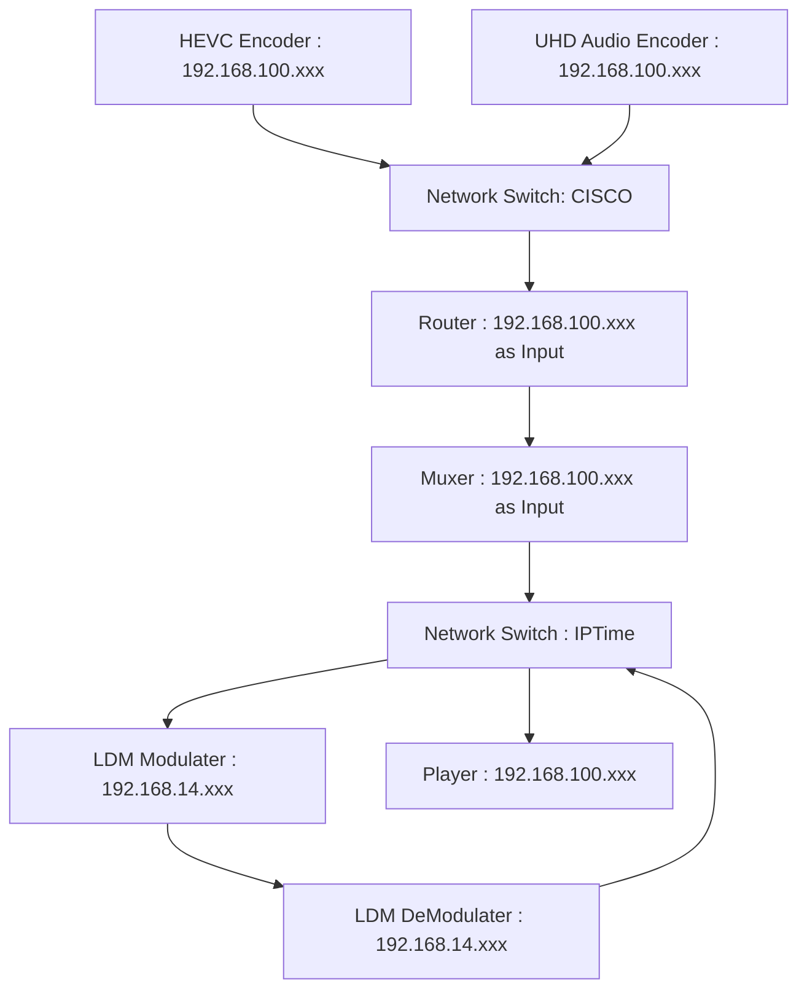

Encoder 부분 향후 과제와 일정
=========================

## R30 테스트
- 실시간 인코더 테스트 
- HDR Encoding Test
   - HDR Contents 인제스트 
   - HDR 지원 인코더 컴파일 예정

## R30 VPP
- System 정합성 테스트
- Transcoder를 사용한 R30 VPP 율제어 성능 체크
- 시스템 Integration

## System Usability 향상
- VCA내 Process Check Shell Script 작성
- VCA내 Process Killing Shell Script 작성
- Encoder 구동 Shell Script 작성

## TTA 테스트 
- 화질 측정 계획 회의 
   - SSIM 기준
   - 화질 측정을 위한 비트율 및 속도 기준
   - Frame 및 Slice 인코딩 관련 기준
   - SDR/HDR 관련 기준
   - 담당자 선정

- 지연시간 Check
   - System 내부 Log 파일 분석

## System 재구축

다음과 같이 재 구축 한 상황 (구체적인 IP 주소 기입 필요)

### 16ch Audio
- SDI 입력시 OverSampling 문제
   - Adobe Premire에서 Over Sampling이 발생하는지 4K Interface에서 발생하는지 Check 필요
   - Adobe Premire에서 나오는 출력으로 16ch Check 필요 (목/금, 마루이엔지)

## 일정
다음 일정은 전체 Lab Test에 들어가기 전, Encoder를 중심으로 어떤 일을 완료해야 할지에 대한 일정 입니다.
하기 일정 (TTA 테스트 제외) 이 완료되는대로 LAB Test를 위한 다음 일정에 들어가는 것이 맞을 듯 합니다.
(예를 들어 Rack에 인코더 시스템 구축)

| 항목 | 세부항목 | 완료 예정일 |
|----|----|----|
|R30 테스트|실시간 인코더 테스트  | 1/19 |
|         | HDR Encoding Test |  HDR Contents 인제스트 (완료) |
|         |                   |  HDR 지원 인코더 컴파일 (1/23) |
|         |                   |  실시간 인코더 테스트 (1/24)   | 
|R30 VPP  | System 정합성 테스트| 1/23 |
|         | Transcoder를 사용한 R30 VPP 율제어 성능 체크 | 1/24 |
|         | 시스템 Integration | 2/3 |
|System Usability 향상 | VCA내 Process Check Shell Script 작성 | 1/20 |
|                     | VCA내 Process Killing Shell Script 작성 | 1/24|
|                     | Encoder 구동 Shell Script 작성 | 1/24 |
|TTA 테스트|화질 측정 계획 회의| 1/20 or 1/24|
|         |화질 측정 및 결과보고서 작성| 2/7 |
|         |Log 파일 분석 및 결과보고서 작성| 2/7 |
|16ch Audio| SDI 입력시 OverSampling 문제| Adobe Premire 출력 시험 (1/20)|
|          |                           |  출력 시험 후 항목 정리/일정 수립|

