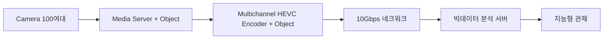

스마트구루 기술협의
================

## 회사 상황
- KT 에서의 일감이 줄어들면서 회사 사정이 많이 어려워진 상황
- 과거에 비해 1/3 정도 줄어든 수준
- 정부 과제를 하더라도 향후, 회사 존속이라는 측면에서 어려워질 수 있음
- 미디어 관련 R&D 조직이 해체 되어 어려워짐

## RNDB 사업에 대한 입장
- 현재 R&D 조직이 없어 자체적인 추가 기술 개발의 의지가 박약
- KT 에서 주어지는 일을 과제화 한다면 생각이 있음
- RNDB 사업이나 바우처 사업에서 요구하는 기술 개발 성격이 아닌 시스템 통합에 관련된 일이기 떄문에 중소기업 기술 개발 사업화가 어려울 것으로 판단

## 결론
- 바우처 사업, RNDB 사업 파트너로서는 어려울 것으로 판단됨
- 스마트구루를 통해 ** 네이버 시스템 ** 과 연결을 가질 필요성이 있음

## 네이버 시스템즈
- 주력 사업 
  - IOT, 빅데이터 분석, GIS 
  - 스마트팩토리 : 빅데이터 분석 효율적인 공장 운영 
     - 현대중공업과 협업 중
     - 공장 관제 
     - 효율성 관리 : PLM

- 중요 issue
   - 실시간성
   - object 추출 및 전송 
      - object 자체는 카메라에서 나옴  

- 목요일에 관련 자료를 받기로 하였음