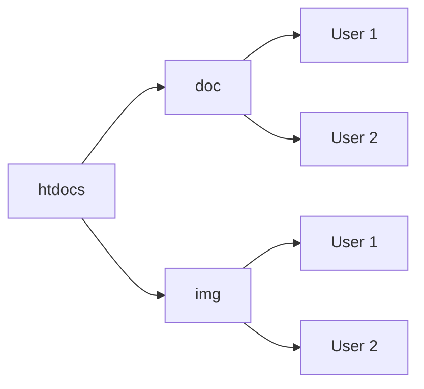

실감 AV 미디어 딥코딩 HTTPD 서버
=============================

## Apache 서버 
- Apache Server 2.2
- Subversion Server 1.5.3
- Git Server (설치예정)
- 설치자 석진욱

## SSH 서버와 연동
Open SSH 서버 설치를 통해 SSH 로 212 서버를 Command 창에서 제어할 수 있습니다.
SSH 로그인 방법은 다음과 같습니다.
~~~
ssh Admin@129.254.61.212
ssh root@129.254.61.212
~~~
password는 저에게 따로 문의해 주십시요.

## Subversion 연동
그동안 애용해 주셨던 Subversion 서버를 212 서버로 이동하고자 합니다.
기존 129.254.64.145 에 있던 프로젝트들의 경우 각자 212 서버 Subversion으로 이동시켜 주십시요.
무엇보다, 구 SVN 서버의 경우 Berkely DB 4.4 를 사용하는 바람에 발생하였던 문제점을 fsfs 파일시스템 DB로 바꾸어서 문제점을 해소할 수 있도록 해보겠습니다. (아직 안되었음.. ㅠㅠ)

## HTDOC 폴더 구성
다음과 같이 구성하여 HTDOC 폴더를 정리하고자 합니다.

