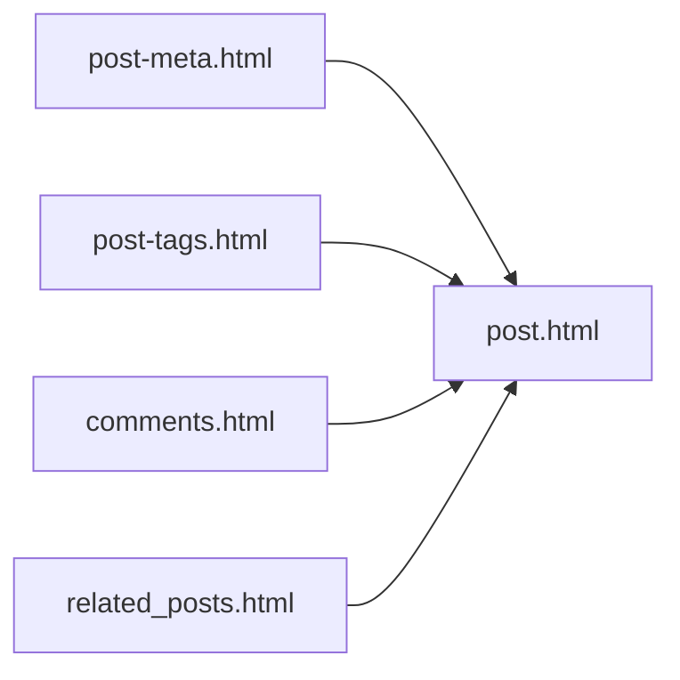

* Table of Contents
{:toc}

## Jekyll의 기본적인 구조
Jekyll의 기본적인 동작 구조는 다음과 같다. (기본 디렉토리 구조는 [Jekyll page](https://jekyllrb-ko.github.io/docs/structure/) 참조)

### _config.yml
Jekyll Site를 위한 각종 변수를 세팅하는 파일이다.
Jekyll에서 사용하는 기본적인 변수 이외에 스스로 만든 변수들도 여기에 정의하면 된다.
한가지 주의할 점은 _config.yml 을 변경 시키고 혹은 새로운 변수를 정의한 다음에는 반드시 Jekyll serve 를 OFF 시킨 다음 ON 시켜야 올바로 해당 내용이 반영된다.

### include 폴더
Jekyll은 (그리고 Theme들은) 반드시 include 폴더에 테마나 변수들에 의해 정의되는 HTML 파일을 include 폴더에 저장하고 이를 변수화 시켜서 사용한다.
예를 들어 본 페이지에서 다루는 Google Analytics나 Google Adsense의 경우도 Google에서 제공하는 HTML 코드를 이곳에서 HTML 파일로 만든 다음, Layout  폴더에서 실제 해당 페이지를 서술하는 HTML 파일에서 불러서 사용하도록 한다. 예를 들어 Google Analytics를 위한 HTML 파일을 google_adsense.html 라 하면 이 파일을 include 폴더에 넣고 다른 HTML 파일에서 다음과 같이 불러서 사용한다.

~~~html

~~~

### Layout 폴더

Jekyll 내에서 보여지는 페이지의 모양은 Layout 폴더에 있는 HTML 파일로 지정 되어진다. 예컨데, post 되는  페이지를 구성하는 post.html의 경우 다음과  같이 4가지 HTML 파일 (/include 에 존재하는) 로 구성되어 진다. (post의 경우 제목과 내용은 markdown 을 해석하여 만들어진 변수의 형태로 들어가게 된다.)

기본적인 Jekyll Page는 **default.html** 과 **post.html** 의 두가지이다.  

- default.html은 Blog Page이 가장 기본적인 얼개, 모양을 도시하도록 되어 있다. Hydeout Theme에서는 다음과 같이 되어 있지만,   

## Google Analytics 적용

Hydeout Theme의 경우  Google Analytics의 적용이 Default로 구현이 되어 있다. 따라서, Google Adsense를 구현하기 위하여 먼저  Google Analytics가 어떻게 구현되어 있는지를 먼저 분석하고, Google Analytics가 동작하도록 만들어야 한다.

### Jekyll/Hydeout Theme에서 Google Analytics

## Google Adsense 적용

의외로 간단하다.\
**Google Analytics** 의 적용방식을 참고하여 만들면 된다.

-   먼저 다음의 Google Adsense code (맨 처음, Mail을 통해 받게 된다.)를  가지고 **google_adsense.html** 을 만든다.

~~~html
    <!-- google_ad_client: "ca-pub-1234567898765432" -->
	
    

    <!-- google Adsence -->
    
    

    

~~~

-   위 html에서 "<!-- google Adsence -->" 에서 "</script>" 까지가 Google Adsense로 부터 제공받은 코드이다.  	
-   if 문이 들어가게 된 까닭은 google adsense를 적용되지 않을 시에는 단순히 \_config.yml에서 해당 파라미터를 지우면 되도록 하기 위해서이다.
-   google\_ad\_client의 값을 \_config.yml을 통해 받기 위해 다음과 같이 \_config.yml에 파라미터를 추가한다.

~~~html
    <code class="ruby">
    google_ad_client: ca-pub-1234567898765432
    </code>
~~~
-   그 다음, google\_analytics.html 이 적용된 html을 찾아본다.
    -   해당 파일은 Hydeout Theme에서는 **head.html**에 다음과 같이 적용되어 있다.

~~~html
      <title>
        
          {{ site.title }} &middot; {{ site.tagline }}
        
          {{ page.title }} &middot; {{ site.title }}
        
      </title>

      

~~~

-   여기에 다음과 같이 Google Adsense를 적용시킨다.

~~~html
    <code class="ruby">
      <title>
        
          {{ site.title }} &middot; {{ site.tagline }}
        
          {{ page.title }} &middot; {{ site.title }}
        
      </title>

      
      
    </code>
~~~

post.html 파일에 Debug Code를 넣고 테스트 해보면 된다.

참고 사이트
-----------

[Jekyll 애드센스 승인받기 ](http://leechoong.com/posts/2018/jekyll_adsense/)\
[Google Analytics & AdSense for Jekyll Blogs](https://flipdazed.github.io/blog/website/google-adsense-and-google-analytics)

